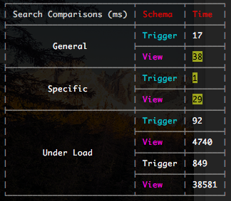
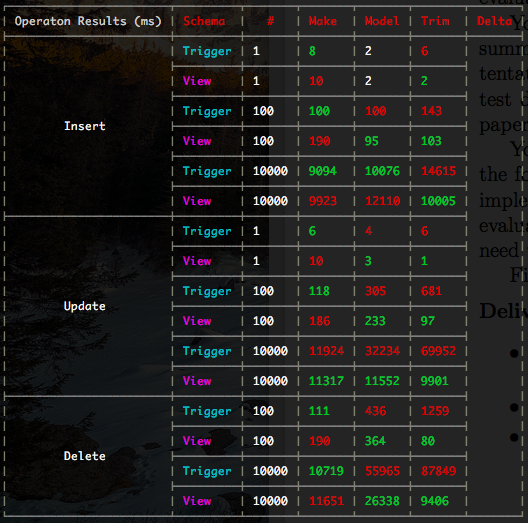

# Maintaining Indexed Search Tables using Triggers
Proof of Concept  
Matt Forster, 001044291  
Wendy Osborn  
2016-11-28  
 
 
  
## Summary
### Tables

To test the creation and maintenance of search documents in an environment with multiple tables holding search documents, we used three tables with references to each other: _Make_, _Model_ and _Trim_. Each table holds at least one column which effects the search document of the resulting vehicles. _Model_ can be specified as two types, _Certified_ or _New_, which flags whether or not the model has _Trim_ data or not.

### Triggers and the Tiered Information Model 

Triggers are defined on all three tables. We have two types of triggers defined;

1.  For the maintenance of atomic __search documents__, and
2.  For the maintenance of the the combined __search records__

The __search document__ triggers maintain a document column on each table separately. These documents include the individual search vectors for each table. We maintain these vectors so that that the record triggers do not have to rebuild vectors that were not modified. These triggers should always act before updates.  
  
The __search record__ triggers maintain the actual _vehicle_search_ table, which combines the separate table documents into the combined search record. These triggers should always act after updates, and target the _vehicle_search_ table, not the table they are attached to.

### Covers all operations on vehicles

The triggers are defined so that all operations that effect the search table (_Create, Update, Delete_) update the search table independently. Users do not have to worry about maintaining the search table, anything that effects it is handled automatically.

### Allows for two types of vehicle

Model can support two types of vehicle, with different data attached to each. This requires two types of triggers, some that trigger on each type. This allows for each type to be updated with side effects and unneeded operations being executed. Allowing for independent updates of each type is important for speed and clarity.

### Updates effect search documents

Updates above the chain (_on Model, and Make_) effect the _search records_ below them. Because of this, triggers are defined on _Make_ and _Model_ which cascade the changes from their atomic __search documents__ to the combined __search records__. These cascades are expected to be the most costly operations, and should be only run when they are needed (ex. not on certified models, because they do not effect any trims.)

## Implementation Details

### Tables and Schema Separation

Table Declarations:   [migrations/structure/sqls/20161117034124-tables-up.sql](migrations/structure/sqls/20161117034124-tables-up.sql)  
  
Here, the tables are defined in two environments, the `trigger` schema and the `view` schema. This allows for maintenance of two environments separate from the costs of each other. ID's are defined as their own columns in UUID format. This allows for quick selection of known ID's through the primary key index.

### Search table

Search Table Declaration:   [migrations/triggers/sqls/20161117050030-search-tables-up.sql](migrations/triggers/sqls/20161117050030-search-tables-up.sql)  
  
Search Index Declaration:
[migrations/triggers/sqls/20161122013700-search-index-up.sql](migrations/triggers/sqls/20161122013700-search-index-up.sql)  
  
The search table maintains it's primary key through two foreign references, one to model and one to trim. This allows new and certified vehicles to be identified and searched for in the table. A GIN () index is defined on the document column to aid in the searching of the vectors.

### Triggers
#### Search Document Triggers

Search Document Trigger Declarations: [migrations/triggers/sqls/20161122031316-search-triggers-up.sql](migrations/triggers/sqls/20161122031316-search-triggers-up.sql#L38-53)  
  
These triggers are responsible for creating and maintaining the atomic search documents. Attached to the tables they modify, we've used a built-in Postgres function to do the work. We define the document column, the text search catalog to use, and the text fields to include in the document.

#### Search Record Triggers

Search Record Trigger Declarations: [migrations/triggers/sqls/20161122031316-search-triggers-up.sql](migrations/triggers/sqls/20161122031316-search-triggers-up.sql#L329-349)  
  
These triggers are responsible for creating the search records, for both trims and certified models. The model trigger functions only execute completely when the models are flagged as certified (they short circuit otherwise). This allows new models to rely on the trim triggers to include their information in the records. 

#### Cascading Triggers

Cascading Trigger Declarations: [migrations/triggers/sqls/20161122031316-search-triggers-up.sql](migrations/triggers/sqls/20161122031316-search-triggers-up.sql#L351-357)  
  
These triggers are responsible for cascading changes from information above trim / model into the __search records__. Each procedure finds the related records and runs updates on the _vehicle_search_ table based on the ID's. We have to loop through each record effected, because each record could potentially have different parents / children and we need to build the search record based on that information. This makes the cascades costly and the slowest element of the operations.

### Atomic document origins

The atomic documents are used to cut the costs of building the search records, and to provide a separation of the time spent building the record. Creating the vectors and storing them with their information allows us to avoid rebuilding the lexemes for every table every time a part of the chain is updated. 

#### Cascading Updates

Cascading Update Functions:
[migrations/triggers/sqls/20161122031316-search-triggers-up.sql](migrations/triggers/sqls/20161122031316-search-triggers-up.sql#L196-282)  
  
Updates on _Make_ and _Model_ and changes to their documents are necessarily cascaded onto the search records that they effect. This allows the search records to stay relevant after updates to the chain. Additional trigger events are added to the _Make_ and _Model_ document columns to ensure that these cascades are executed. Each record effected must be selected and updated individually as they are all essentially different.

### View comparison environment

View environment Declaratons:
[migrations/view/sqls/20161122011916-search-view-up.sql](migrations/view/sqls/20161122011916-search-view-up.sql)  
  
The environment used for comparison is one being used in production today. The environment is built alongside the trigger testing environment and is then used to compare load times.

### Correctness Tests

Correctness Test Definitions:
[test/unit.test.js](test/unit.test.js)  
  
Unit tests for the trigger environment are defined to ensure the function definitions are correct. Basic operations are tested, and the search documents created are also tested. These tests are used during development to guide and confirm the code.

### Seeding

Seeding script:
[seed.js](seed.js)  
  
The database can be seeded for load testing and inspection. Three levels are available, 0, 1, 2; whereas 0 is a minimum amount of records, 1 is a medium amount, and 2 is a large amount. This script is used to load the database at level 2 before the load tests are run.

## Evaluation Strategy

Load Test Declarations (Operations): [load/operation.test.function.js](load/operation.test.function.js)  
  
Load Test Declarations (Search):
[load/search.test.js](load/search.test.js)  
  
Reporting Script:
[report.js](report.js)  
  
The load tests are run on serial connections, to allow for a correct measurement of the cost of the operations. Single connection pools are declared and used for the tests. Operations are tested using one, one hundred and ten thousand rows being inserted, updated and deleted from both schemes. Test results are gathered and saved in files in the same folder. The search tests are conducted in the same way, against both schemes, using simple queries, complex queries, and one hundred and ten thousand serial tests. Results are gathered and saved. We have defined a reporting script to use the data that was collected and present it in a way that can be digested and regarded.
  
## Results

### Observations

As expected, the trigger's extra operations on top of the regular operations on the tables increase their cost. The significant cost of the update and delete can be seen in the ten thousand updates and deletes. The cost of updating the tables with the triggers is __706%__ greater than without the triggers.  
  
The search results also come as expected. The greater cost of operations on the tables is balanced by the lower cost of the more important search operations. The cost of the trigger maintained search is only __2% of the cost__ of the view.

### Considerations

-   Updating the models from one type to another would leave the search table in an inconstant state, which would require more triggers on model to update. This is more or less an application responsibility to ensure that models with trims defined are not moved to certified.  
  
-   Triggers are necessarily defined on the columns that make up the documents of each table, as updates triggered by the search document triggers do not continue the execution of the triggers defined after updates. So, updates must be based on the base columns that make up the documents.

### Conclusion

Given the usage of search compared to how often the vehicles are updated, the cost of the operations on the tables is greatly out weight by the gains of speed and efficiency of the new indexed search table. Not only are the searches more robust, where matches are found more often to users queries, but much faster.
